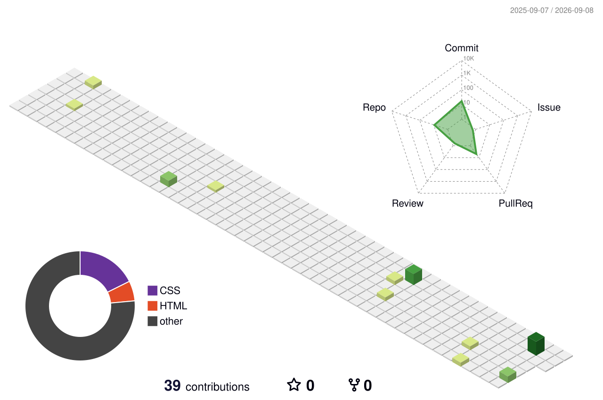

<h1 align="center">Hi 👋, I'm Tushar Bodake</h1>

<h3 align="center">
  Full Stack Java Developer • Computer Engineering Student • Open Source Enthusiast
</h3>

<p align="center">
  <a href="https://github.com/tushar-bodake">
    
  </a>
  <a href="https://github.com/tushar-bodake?tab=followers">
    
  </a>
  <a href="https://github.com/tushar-bodake?tab=repositories">
    
  </a>
</p>

---

## 👨‍💻 About Me

* 🎓 Computer Engineering student at **AISSMS Institute of Information Technology, Pune**
* 💻 Focused on **Full Stack Java Development**
* 🌱 Currently improving my skills in **Java, Spring Boot, React and Backend Development**
* 🚀 Interested in building practical, real-world applications
* 🧩 Currently practicing **DSA, problem solving and software development**
* ☕ Code • Coffee • Repeat

---

## 🔗 Connect With Me

<p align="center">
  <a href="https://tushar-bodake.netlify.app/" target="_blank">
    
  </a>
  <a href="https://www.linkedin.com/in/tushar-bodake-8b526a312/" target="_blank">
    
  </a>
  <a href="mailto:bodaketushar90@gmail.com">
    
  </a>
  <a href="https://www.instagram.com/iam.tushaaar/" target="_blank">
    
  </a>
  <a href="https://leetcode.com/u/_tushar_1234_/" target="_blank">
    
  </a>
</p>

---

## 🛠️ Tech Stack

### Languages

<p align="center">
  
</p>

### Frontend

<p align="center">
  
</p>

### Backend & Database

<p align="center">
  
</p>

### Tools & Platforms

<p align="center">
  
</p>

---

# 📊 GitHub Analytics

<p align="center">
  

  
</p>

<p align="center">
  
</p>

---

# 📈 Contribution Activity

<p align="center">
  
</p>

---

# 🏆 GitHub Achievements

<p align="center">
  
</p>

---

# 🚀 Featured Projects

<table>
<tr>
<td width="50%">

### 💰 Digital Gullak

A modern digital savings/piggy-bank application designed to help users manage savings, deposits and withdrawals.

**Tech:** HTML • CSS • JavaScript • Firebase • PHP • MySQL

</td>

<td width="50%">

### 🏗️ RMC ERP

Enterprise-oriented ERP software developed for managing operations of a Ready Mix Concrete plant.

**Tech:** PHP • MySQL • JavaScript • Bootstrap

</td>
</tr>

<tr>
<td width="50%">

### 🚗 Car Rental Portal

A web-based car rental platform for browsing vehicles and managing rental-related operations.

**Tech:** PHP • MySQL • HTML • CSS • JavaScript

</td>

<td width="50%">

### 🌐 Developer Portfolio

My personal portfolio showcasing my projects, technical skills, experience and development journey.

**Tech:** HTML • CSS • JavaScript

</td>
</tr>
</table>

<p align="center">
  <a href="https://tushar-bodake.netlify.app/">
    
  </a>
</p>

---

# 📚 Currently Learning

```text
Java & Spring Boot       ███████████████░░░░░
React & Frontend         ████████████████░░░░
Data Structures & Algo   ████████████░░░░░░░░
Backend Development      █████████████░░░░░░░
System Design            ████████░░░░░░░░░░░░
```

---

# 🔥 Contribution Streak

<p align="center">
  
</p>

---

# 🌌 3D Contribution Graph

<!--
This section will work after setting up the
github-profile-3d-contrib GitHub Action.

After the Action generates the image, keep this section.
-->

<p align="center">
  
</p>

---

## 📄 Resume

<p align="center">
  <a href="https://drive.google.com/file/d/1rNlS7L8j2JeG29fDY1qX5tE5Cn6eZLy_/view?usp=sharing">
    
  </a>
</p>

---

<h3 align="center">
  💡 Building. Learning. Improving. Every Day.
</h3>

<p align="center">
  <i>Thanks for visiting my profile! ⭐</i>
</p>
