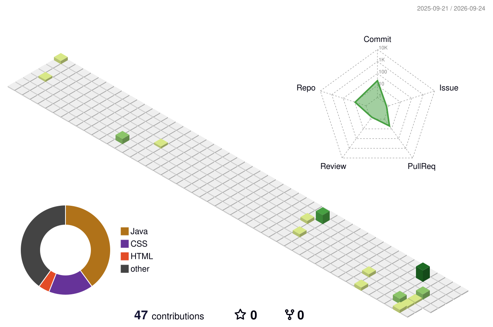

<h1 align="center">Hi 👋, I'm Tushar Bodake</h1>

<h3 align="center">
  Full Stack Java Developer • Computer Engineering Student • Developer
</h3>

  
  

  
  
  

---

## 👨‍💻 About Me

I'm a **Computer Engineering student** and aspiring **Full Stack Java Developer** who enjoys building practical applications and continuously improving my development skills.

* 🎓 Computer Engineering student at **AISSMS Institute of Information Technology, Pune**
* 💻 Focused on **Full Stack Java Development**
* 🌱 Currently learning **Java, Spring Boot, React & Backend Development**
* 🧩 Practicing **Data Structures & Algorithms**
* 🚀 Interested in building practical and real-world software solutions
* ☕ **Code • Coffee • Repeat**

---

## 🌐 Connect With Me

  
  
  
  

---

# 🛠️ Tech Stack

### 💻 Languages

  

### 🎨 Frontend

  

### ⚙️ Backend & Database

  

### 🔧 Tools

  

---

# 📊 GitHub Analytics

  
  

---

# 🔥 Contribution Streak

  

---

# 📈 Contribution Activity

  

---

# 🏆 GitHub Trophies

  

---

# 🚀 Featured Projects

<table>
<tr>

<td width="50%">

### 💰 Digital Gullak

A modern digital savings application for managing savings, deposits, withdrawals and transaction history.

**Tech Stack**

`HTML` `CSS` `JavaScript` `Firebase` `PHP` `MySQL`

</td>

<td width="50%">

### 🏗️ RMC ERP

An ERP-based web application developed for managing operations of a Ready Mix Concrete plant.

**Tech Stack**

`PHP` `MySQL` `JavaScript` `Bootstrap`

</td>

</tr>

<tr>

<td width="50%">

### 🚗 Car Rental Portal

A web-based car rental application for managing vehicles and rental-related operations.

**Tech Stack**

`PHP` `MySQL` `HTML` `CSS` `JavaScript`

</td>

<td width="50%">

### 🌐 Developer Portfolio

My personal portfolio showcasing projects, technical skills, experience and development journey.

**Tech Stack**

`HTML` `CSS` `JavaScript`

</td>

</tr>
</table>

  

  # 🧊 3D Contribution Graph

  

    
  

  ---
---

# 📚 Currently Learning

# 📄 Resume

  

---

<h3 align="center">💡 Building • Learning • Improving</h3>

  <i>Thanks for visiting my profile! ⭐</i>

